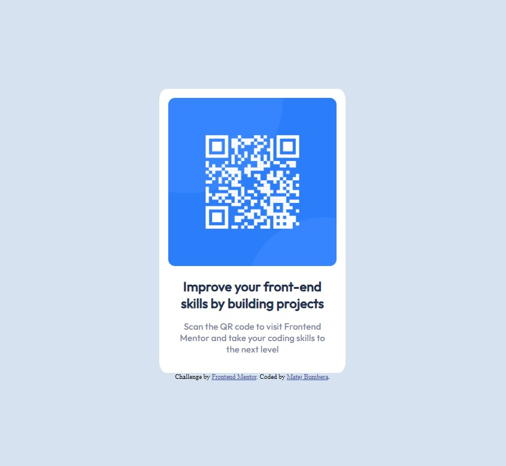

# Frontend Mentor - QR code component solution

This is a solution to the [QR code component challenge on Frontend Mentor](https://www.frontendmentor.io/challenges/qr-code-component-iux_sIO_H). Frontend Mentor challenges help you improve your coding skills by building realistic projects. 

## Table of contents

- [Overview](#overview)
  - [Screenshot](#screenshot)
  - [Links](#links)
- [My process](#my-process)
  - [Built with](#built-with)
  - [What I learned](#what-i-learned)
  - [Useful resources](#useful-resources)
- [Author](#author)

## Overview

### Screenshot

### Links

- Solution URL: [QR-code-component solution using flexbox](https://www.frontendmentor.io/solutions/qrcodecomponent-solution-using-flexbox-hvv5kEMhsE)
- Live Site URL: [QR-code-component](https://matejbumbera.github.io/QR-code-component/)

## My process

### Built with

- Flexbox

### What I learned

I learned how to use a basic flexbox and practicted html and css fundamentals.

### Useful resources

- [W3Schools](https://www.w3schools.com/) - I used W3Schools to learn the html and css basics.
- [freeCodeCamp](https://www.freecodecamp.org/news/html-page-width-height/) - This article was really helpful while trying to figure out why doesn't my body element stretch through the whole site.
- [CSS-Tricks](https://css-tricks.com/snippets/css/a-guide-to-flexbox/) - This article was helpful when I was learning flexbox, I really liked the visual representation of the properties.

## Author

- Frontend Mentor - [@MatejBumbera](https://www.frontendmentor.io/profile/MatejBumbera)

